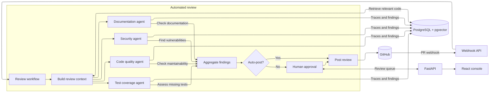
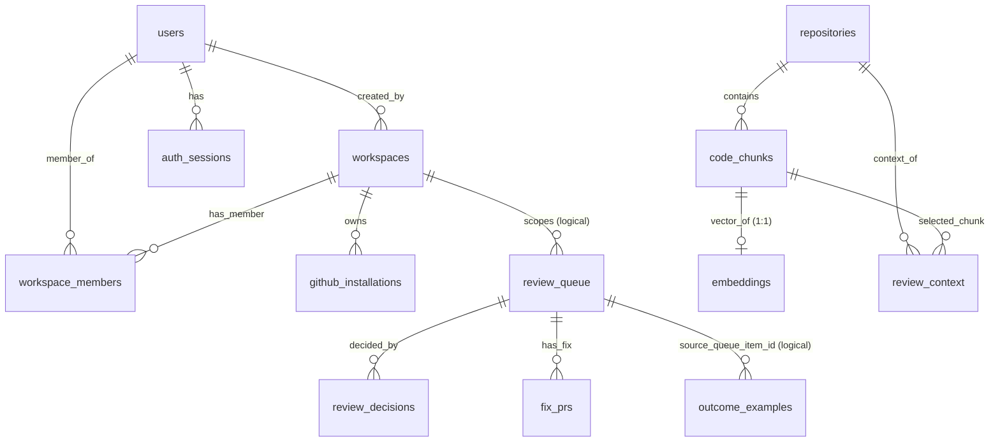

# Perchly

[](https://python.org)
[](https://fastapi.tiangolo.com)
[](https://temporal.io)

**An AI pull-request review agent.** Perchly hooks into repositories through a GitHub App. For supported pull-request events, four LLM specialists run in parallel — **security**, **code quality**, **test coverage**, and **documentation**. Reviews that pass the configured policy are posted automatically; uncertain or high-risk reviews go to a **human-in-the-loop approval queue**.

Every agent action, LLM call, and human decision is recorded as a span in a queryable PostgreSQL table. A live dashboard surfaces cost per review, latency by phase, HITL queue depth, and per-category acceptance rates.

For actionable findings, reviewers can use **Raise Fix PR**. Perchly generates a
reviewable unified diff, shows a preview in the console, and—after confirmation—
creates or reuses a branch and opens a GitHub PR. Generated fix PRs remain normal
human-reviewable PRs; Perchly ignores their webhook events to prevent recursive reviews.

---

## Table of Contents

1. [Quick Start (Docker)](#1-quick-start-docker)
2. [High-Level Design (HLD)](#2-high-level-design-hld)
3. [Low-Level Design (LLD)](#3-low-level-design-lld)
   - [3.1 Webhook Ingestion](#31-webhook-ingestion)
   - [3.2 Temporal Workflow](#32-temporal-workflow)
   - [3.3 Context Retrieval](#33-context-retrieval)
   - [3.4 Specialist Agents](#34-specialist-agents)
   - [3.5 Aggregation & Routing](#35-aggregation--routing)
   - [3.6 HITL Queue](#36-hitl-queue)
   - [3.7 Observability](#37-observability)
   - [3.8 Learning Loop](#38-learning-loop)
4. [Data Model](#4-data-model)
5. [API Reference](#5-api-reference)
6. [Configuration Reference](#6-configuration-reference)
7. [Local Development](#7-local-development)
8. [Project Structure](#8-project-structure)
9. [Architecture Decisions](#9-architecture-decisions)
10. [Roadmap](#10-roadmap)
11. [License](#11-license)

---

## 1. Quick Start (Docker)

### Prerequisites

| Requirement                    | Notes                                                                                                                                                                                                                                                            |
| ------------------------------ | ---------------------------------------------------------------------------------------------------------------------------------------------------------------------------------------------------------------------------------------------------------------- |
| Docker + Docker Compose        | v2.20+ recommended                                                                                                                                                                                                                                               |
| GitHub App                     | [Create one](https://docs.github.com/en/apps/creating-github-apps/creating-github-apps/creating-a-github-app) with `Pull requests: Read & Write`, `Contents: Read & Write`, `Checks: Read & Write`, webhooks for `pull_request` and `pull_request_review` events |
| Gemini API key                 | [Google AI Studio](https://aistudio.google.com)                                                                                                                                                                                                                  |
| Cloud PostgreSQL with pgvector | Any PostgreSQL provider that supports the `vector` extension; enable it for the database.                                                                                                                                                                          |
| ngrok account (optional)       | For exposing the webhook endpoint locally                                                                                                                                                                                                                        |

### Steps

**1. Configure**

```bash
cd perchly
cp .env.docker.example .env
```

Edit `.env` with your credentials (see [§6 Configuration](#6-configuration-reference)). Configure both a GitHub App and GitHub OAuth callback, and generate a `SESSION_SECRET` of at least 32 characters. The observability dashboard uses the signed-in session; no observability API key is needed.

**2. Add your GitHub App private key**

```bash
cp /path/to/your-github-app.private-key.pem server/perchly.private-key.pem
```

Update `GITHUB_PRIVATE_KEY_PATH=/app/perchly.private-key.pem` in `.env`.

**3. Start all services**

```bash
docker compose up -d
```

This starts:

- `perchly-server` — FastAPI backend on `:8000`
- `perchly-worker` — Temporal activity worker
- `perchly-temporal` — Temporal dev server on `:7233` (UI on `:8233`)
- `perchly-web` — React console on `:5173`
- `perchly-ngrok` — ngrok tunnel (configure `NGROK_DOMAIN` for a reserved domain)

**4. Register the webhook**

Set your GitHub App's webhook URL to your ngrok URL:

```
https://<your-subdomain>.ngrok-free.app/webhooks/github
```

**5. Install the App on a repo and open a PR — Perchly will review it.**

---

## 2. High-Level Design (HLD)



### Technology Choices at a Glance

| Layer            | Technology                                        | Why                                                                                            |
| ---------------- | ------------------------------------------------- | ---------------------------------------------------------------------------------------------- |
| Orchestration    | **Temporal** (Python SDK 1.33)                    | Durable execution; native pause/resume via signals for HITL; per-activity retries and timeouts |
| LLM              | **Google Gemini** (`gemini-3.8-flash`)            | Structured tool-use output for typed findings; co-located embedding API                        |
| Embeddings       | **Gemini Embedding** (`gemini-embedding-2`, 768d) | Code-aware embeddings; same API key as generation                                              |
| Vector store     | **pgvector** on cloud-hosted PostgreSQL           | Avoids a second database; retrieval, queue, and spans share the PostgreSQL service               |
| Webhook / API    | **FastAPI** + uvicorn                             | Async, typed, pairs well with Temporal Python SDK                                              |
| Worker process   | **uv** + Temporal activity worker                 | Separate process from API server; isolated failure domain                                      |
| Frontend         | **React 19** + TypeScript + Vite + Tailwind       | SPA proxied to the API; dark terminal aesthetic                                                |
| Tunnel           | **ngrok**                                         | Expose local webhook URL during development                                                    |
| Containerisation | **Docker Compose**                                | Single-command local stack                                                                     |

---

## 3. Low-Level Design (LLD)

### 3.1 Webhook Ingestion

**File:** [`server/app/routers/github_webhooks.py`](server/app/routers/github_webhooks.py)

```
POST /webhooks/github
```

1. **Signature verification** — HMAC-SHA256 over the raw request body using `GITHUB_WEBHOOK_SECRET`. Returns 401 if invalid.
2. **Event filtering** — Only `pull_request` events with actions `opened`, `reopened`, `synchronize` are processed. Review and comment events are used for outcome tracking only.
3. **Idempotency** — A durable SQLite `IdempotencyStore` beneath `PERCHLY_DATA_DIRECTORY` deduplicates webhook delivery IDs and PR-head review runs before workflows start.
4. **Outcome tracking** — `pull_request_review`, `pull_request_review_comment`, and `issue_comment` events containing Perchly's HTML marker update `outcome_examples` with `merged`/`dismissed` signals.
5. **Async hand-off** — Returns `202 Accepted` within milliseconds; all review work happens durably in Temporal.

### 3.2 Temporal Workflow

**File:** [`server/app/temporal/workflows.py`](server/app/temporal/workflows.py)

One `ReviewWorkflow` instance per PR event, keyed by `perchly-review-{repo}-{pr_number}-{head_sha}`.

```
ReviewWorkflowInput
  delivery_id, repository, pr_number, head_sha, installation_id

Activity sequence:
  fetch_review_context          (timeout 3m, max 3 retries)
  retrieve_repository_context   (timeout 3m, max 3 retries)
  run_specialist × 4            (timeout 2m each, max 2 retries, asyncio.gather)
  aggregate_review              (timeout 3m, max 3 retries)
  route_aggregated_review       (timeout 3m, max 3 retries)
  ├── [auto_post]
  │     post_review → persist_automatic_decision
  └── [needs_approval]
        workflow.wait_condition(decision is not None)   ← durable pause
        ├── [approve/edit]
        │     validate_edited_review? → post_review → persist_reviewer_decision
        └── [reject]
              persist_reviewer_decision  (no post)

On any exception:
  release_review_claim  (clears idempotency key so the PR can be re-reviewed)
```

**Signals** sent from the API server via `send_signal_by_workflow_id`:

- `approve_review(ReviewDecisionInput)`
- `reject_review(ReviewDecisionInput)`
- `edit_review(ReviewDecisionInput)` — carries `edited_review` JSON

**Query:** `status()` → `{state, decision}` — readable from the API without polling.

### 3.3 Context Retrieval

**File:** [`server/app/services/retrieval.py`](server/app/services/retrieval.py)

Retrieval runs in two activities:

**Stage 1 — Fetch** (`fetch_review_context`):

- GitHub API: diff (`application/vnd.github.v3.diff`), PR title and body.
- GitHub API: full text of each changed file at `head_sha`.
- Relative-import graph walk — up to 20 related files are fetched for additional context.

**Stage 2 — Embed & Query** (`retrieve_repository_context`):

- Changed files are chunked (line-bounded, function-boundary-aware where possible).
- Each chunk is embedded via Gemini Embedding API (768 dimensions).
- Chunks are upserted into `code_chunks` + `embeddings` tables in PostgreSQL.
- Top-K chunks (default 5) are retrieved per specialist agent's query vector.
- Returned as a structured context string prepended to each specialist's system prompt.

> **Note:** The index is incremental. Only files that appear in reviewed PRs are indexed. Unvisited files accumulate over time; no full-repo clone is required.

### 3.4 Specialist Agents

**Files:** [`server/app/agents/`](server/app/agents/)

| Agent           | Focus                                                                                |
| --------------- | ------------------------------------------------------------------------------------ |
| `security`      | Injection, auth/authz gaps, secret leakage, unsafe deserialization, dependency risk  |
| `quality`       | Complexity, duplication, naming, dead code, anti-patterns                            |
| `test_coverage` | Untested branches/functions introduced by the diff, missing edge cases               |
| `docs`          | Missing/outdated docstrings, README/changelog drift, undocumented public API changes |

Each agent is a `SpecialistAgent` dataclass with a category-scoped system prompt. The underlying `review_diff` call uses Gemini's structured tool-use API with the `Finding` Pydantic schema — no free-text parsing.

```python
# server/app/schemas/findings.py
class Finding(BaseModel):
    finding_id: str | None       # stable SHA-256 (repo, pr, sha, category, file, lines, message)
    category: FindingCategory    # security | quality | test_coverage | docs
    file: str
    line_start: int
    line_end: int
    severity: FindingSeverity    # info | warning | critical
    confidence: float            # 0.0 – 1.0
    message: str
    suggested_fix: str | None
```

All four agents run as **parallel Temporal activities** via `asyncio.gather(..., return_exceptions=True)`. A failure or timeout in one agent is recorded as a `specialist_failure` and does not block the others. If any agent fails, the aggregator routes the review to HITL.

Historical outcome examples from the `outcome_examples` table are prepended as few-shot calibration context. The agent is instructed to use them only for confidence calibration, not to copy past findings.

### 3.5 Aggregation & Routing

**Files:** [`server/app/services/aggregation.py`](server/app/services/aggregation.py), [`server/app/services/routing.py`](server/app/services/routing.py)

**Aggregation:**

- Merges findings from all four agents.
- Assigns stable `finding_id` (SHA-256 over `repo + pr + sha + category + file + lines + message`).
- Deduplicates findings that share the same `finding_id`.

**Routing policy:**

| Condition                                | Route            | Reason key                              |
| ---------------------------------------- | ---------------- | --------------------------------------- |
| Any specialist failure                   | `needs_approval` | `specialist_failure`                    |
| Any unresolved error                     | `needs_approval` | `unresolved_review_error`               |
| Finding count > `MAX_AUTO_POST_FINDINGS` | `needs_approval` | `finding_count_exceeds_auto_post_limit` |
| Any critical security finding            | `needs_approval` | `critical_security_finding`             |
| Any finding confidence < threshold       | `needs_approval` | `finding_below_confidence_threshold`    |
| All conditions pass                      | `auto_post`      | `all_findings_meet_policy`              |

Configurable thresholds:

- `PERCHLY_AUTO_POST_THRESHOLD` (default `0.90`) — all categories
- `PERCHLY_SECURITY_AUTO_POST_THRESHOLD` (default `0.95`) — security findings only
- `PERCHLY_MAX_AUTO_POST_FINDINGS` (default `20`) — finding count cap

### 3.6 HITL Queue

**Files:** [`server/app/services/review_queue.py`](server/app/services/review_queue.py), [`server/app/routers/reviews.py`](server/app/routers/reviews.py)

When routing returns `needs_approval`:

1. The full review payload (findings, specialist failures, PR metadata) is persisted to `review_queue` in PostgreSQL.
2. The Temporal workflow enters `workflow.wait_condition` — durably paused, survives worker restarts, waits indefinitely for a signal.
3. The console's **Approval Queue** page (`GET /reviews/queue`) lists pending items with findings, confidence, severity, and suggested fixes.
4. The reviewer clicks **Approve**, **Reject**, or **Edit** (with modified findings JSON).
5. The API server sends the corresponding Temporal signal (`approve_review`, `reject_review`, `edit_review`).
6. The workflow resumes, posts to GitHub (if approved or edited), records the decision, and completes.

### Agent-authored fix PRs

Each finding with a suggested fix exposes a **Raise Fix PR** action:

1. `POST /reviews/queue/{id}/findings/{finding_id}/fix-pr/preview` builds and persists a structured patch without changing GitHub.
2. The UI displays the unified diff and affected files for reviewer confirmation.
3. `POST /reviews/fix-pr/{fix_id}/create` validates the preview against the original `head_sha`, creates or reuses a `perchly/fix/...` branch, commits one or more files, and opens a PR against the original PR's base branch.
4. Repeated confirmation is idempotent and returns the existing open PR.
5. The `<!-- perchly-generated-fix-pr -->` marker prevents the generated PR from starting another Perchly review. A human still reviews and merges it normally.

The `fix_prs` table stores the preview, reviewer, status, branch, pull-request URL, and timestamps. Plain replacement suggestions become one-file unified diffs; fenced unified diffs can update multiple files.

**Database protocol:** All writes use PostgreSQL's **simple-query protocol** — values are inlined as SQL literals via `_sql_literal()`. This is required because Neon's transaction-mode pooler routes pg8000's extended-protocol `Parse`/`Bind` messages to different backends, causing `SQLSTATE 26000`. Single-quote doubling is the only escaping needed (`standard_conforming_strings = on`).

### 3.7 Observability

**File:** [`server/app/services/telemetry.py`](server/app/services/telemetry.py)

Every Temporal activity emits a span via `write_span_sync()`, stored in the `agent_spans` table (TimescaleDB hypertable when the extension is available, plain table otherwise).

Span fields: `review_run_id`, `repository`, `pr_number`, `head_sha`, `agent`, `phase`, `span_type` (`llm_call` / `tool_call` / `retrieval`), `model`, `tokens_in`, `tokens_out`, `cost_usd`, `latency_ms`, `input_summary`, `output_summary`, `status`, `error_message`.

**Materialized views** refreshed every 5 minutes by a background `asyncio` task:

- `daily_review_metrics` — per-day: review count, total cost, p50/p95 latency, acceptance rates.

**Dashboard endpoints** (`/observability/*`) require the signed-in GitHub session and a workspace assignment, matching the review console. Telemetry queries are not yet filtered by workspace; do not treat the dashboard as tenant-isolated.

### 3.8 Learning Loop

**File:** [`server/app/services/outcome_retrieval.py`](server/app/services/outcome_retrieval.py)

Every finding's final outcome is stored in `outcome_examples`:

| Path                              | Outcome     |
| --------------------------------- | ----------- |
| Auto-posted                       | `approved`  |
| Approved in queue                 | `approved`  |
| Edited in queue                   | `edited`    |
| Rejected in queue                 | `rejected`  |
| GitHub review dismissed (webhook) | `dismissed` |

Before each specialist agent runs, a small number of similar past findings (retrieved by vector similarity of the finding's embedding) are prepended as few-shot calibration examples. The agent prompt instructs it not to copy findings — only to calibrate confidence based on what kinds of findings were accepted vs. rejected in the past.

---

## 4. Data Model

PostgreSQL tables are initialized at runtime via `CREATE TABLE IF NOT EXISTS` DDL (no Alembic/Prisma migrations). All table DDL lives in the service modules under `server/app/services/`.

### Core tables



```text
users
  id              BIGSERIAL               PK
  github_id       BIGINT   NOT NULL   UNIQUE
  login           TEXT     NOT NULL
  name            TEXT     NOT NULL
  avatar_url      TEXT                  nullable
  created_at      TIMESTAMPTZ NOT NULL  DEFAULT CURRENT_TIMESTAMP
  updated_at      TIMESTAMPTZ NOT NULL  DEFAULT CURRENT_TIMESTAMP

workspaces
  id              BIGSERIAL               PK
  name            TEXT     NOT NULL
  slug            TEXT     NOT NULL   UNIQUE
  created_by_user_id BIGINT            REFERENCES users(id)
  created_at      TIMESTAMPTZ NOT NULL  DEFAULT CURRENT_TIMESTAMP
  updated_at      TIMESTAMPTZ NOT NULL  DEFAULT CURRENT_TIMESTAMP

workspace_members
  workspace_id    BIGINT   NOT NULL   FK→workspaces(id) ON DELETE CASCADE
  user_id         BIGINT   NOT NULL   FK→users(id) ON DELETE CASCADE
  role            TEXT     NOT NULL   DEFAULT 'member'
                          CHECK (role IN ('owner','admin','member'))
  created_at      TIMESTAMPTZ NOT NULL  DEFAULT CURRENT_TIMESTAMP
  PRIMARY KEY (workspace_id, user_id)

github_installations
  id              BIGSERIAL               PK
  installation_id BIGINT   NOT NULL   UNIQUE
  workspace_id    BIGINT   NOT NULL   FK→workspaces(id) ON DELETE CASCADE
  account_login   TEXT                  nullable
  account_type    TEXT                  nullable
  created_at      TIMESTAMPTZ NOT NULL  DEFAULT CURRENT_TIMESTAMP
  updated_at      TIMESTAMPTZ NOT NULL  DEFAULT CURRENT_TIMESTAMP

auth_sessions
  id              UUID      PRIMARY KEY
  user_id         BIGINT   NOT NULL   FK→users(id) ON DELETE CASCADE
  expires_at      TIMESTAMPTZ NOT NULL
  revoked_at      TIMESTAMPTZ                  nullable
  created_at      TIMESTAMPTZ NOT NULL  DEFAULT CURRENT_TIMESTAMP

review_queue
  id              BIGSERIAL               PK
  workspace_id    BIGINT                         logical FK→workspaces(id) [no FK constraint, added via ALTER TABLE]
  delivery_id     TEXT     NOT NULL
  repository      TEXT     NOT NULL
  pr_number       INTEGER  NOT NULL
  head_sha        TEXT     NOT NULL
  review_payload_json JSONB   NOT NULL
  specialist_failures_json JSONB   NOT NULL DEFAULT '{}'::jsonb
  status          TEXT     NOT NULL   DEFAULT 'pending'
                          CHECK (status IN ('pending','approved','rejected','edited','expired'))
  reason          TEXT     NOT NULL
  created_at      TIMESTAMPTZ NOT NULL  DEFAULT CURRENT_TIMESTAMP
  updated_at      TIMESTAMPTZ NOT NULL  DEFAULT CURRENT_TIMESTAMP
  resolved_at     TIMESTAMPTZ                 nullable
  resolved_by     TEXT                  nullable
  UNIQUE (repository, pr_number, head_sha)

review_outcomes
  id              BIGSERIAL               PK
  delivery_id     TEXT     NOT NULL
  repository      TEXT     NOT NULL
  pr_number       INTEGER  NOT NULL
  head_sha      TEXT     NOT NULL
  outcome         TEXT     NOT NULL   (one of: auto_post, approved, edited, rejected, dismissed, resolved)
  review_payload_json JSONB   NOT NULL
  reason          TEXT     NOT NULL
  created_at      TIMESTAMPTZ NOT NULL  DEFAULT CURRENT_TIMESTAMP
  updated_at      TIMESTAMPTZ NOT NULL  DEFAULT CURRENT_TIMESTAMP
  UNIQUE (repository, pr_number, head_sha)

review_decisions
  id                BIGSERIAL               PK
  queue_item_id   BIGINT   NOT NULL   FK→review_queue(id) ON DELETE CASCADE
  decision        TEXT     NOT NULL   CHECK (IN ('approve','reject','edit'))
  edited_review_json JSONB                nullable
  reviewer        TEXT     NOT NULL
  comment         TEXT                  nullable
  created_at      TIMESTAMPTZ NOT NULL  DEFAULT CURRENT_TIMESTAMP

fix_prs
  id                BIGSERIAL               PK
  queue_item_id   BIGINT   NOT NULL   FK→review_queue(id) ON DELETE CASCADE
  finding_id      TEXT     NOT NULL
  patch_json      JSONB    NOT NULL
  reviewer        TEXT     NOT NULL
  status          TEXT     NOT NULL   CHECK (IN ('previewed','created','failed'))
  branch          TEXT                  nullable
  pull_request_url TEXT                 nullable
  created_at      TIMESTAMPTZ NOT NULL  DEFAULT CURRENT_TIMESTAMP
  updated_at      TIMESTAMPTZ NOT NULL  DEFAULT CURRENT_TIMESTAMP
  UNIQUE (queue_item_id, finding_id)

outcome_examples
  id                  BIGSERIAL               PK
  repository        TEXT     NOT NULL
  pr_number         INTEGER  NOT NULL
  head_sha        TEXT     NOT NULL
  finding_id      TEXT     NOT NULL
  category        TEXT     NOT NULL
  finding_json    JSONB    NOT NULL
  final_outcome   TEXT     NOT NULL   CHECK (IN ('auto_post','approved','edited','rejected','dismissed','resolved'))
  reviewer        TEXT                  nullable
  source_queue_item_id BIGINT          nullable   logical FK→review_queue(id)
  source_review_run_id TEXT          nullable
  embedding_model TEXT                  nullable
  embedding       vector(768)            nullable   pgvector
  created_at      TIMESTAMPTZ NOT NULL  DEFAULT CURRENT_TIMESTAMP
  UNIQUE (repository, pr_number, head_sha, finding_id, final_outcome)

repositories
  id              BIGSERIAL               PK
  full_name       TEXT     NOT NULL   UNIQUE
  created_at      TIMESTAMPTZ NOT NULL  DEFAULT CURRENT_TIMESTAMP

code_chunks
  id                BIGSERIAL               PK
  repository_id   BIGINT   NOT NULL   FK→repositories(id) ON DELETE CASCADE
  head_sha        TEXT     NOT NULL
  path            TEXT     NOT NULL
  line_start      INTEGER  NOT NULL
  line_end        INTEGER  NOT NULL
  content         TEXT     NOT NULL
  embedding_model TEXT     NOT NULL
  created_at      TIMESTAMPTZ NOT NULL  DEFAULT CURRENT_TIMESTAMP
  UNIQUE (repository_id, head_sha, path, line_start, line_end)

embeddings
  chunk_id        BIGINT   PRIMARY KEY   FK→code_chunks(id) ON DELETE CASCADE
  vector          vector(768) NOT NULL   pgvector
  model           TEXT     NOT NULL

review_context
  id                BIGSERIAL               PK
  repository_id   BIGINT   NOT NULL   FK→repositories(id) ON DELETE CASCADE
  head_sha        TEXT     NOT NULL
  category        TEXT     NOT NULL   (security / quality / test_coverage / docs)
  chunk_id        BIGINT   NOT NULL   FK→code_chunks(id) ON DELETE CASCADE
  rank            INTEGER  NOT NULL
  similarity      REAL     NOT NULL
  created_at      TIMESTAMPTZ NOT NULL  DEFAULT CURRENT_TIMESTAMP
  UNIQUE (repository_id, head_sha, category, chunk_id)

agent_spans
  id                BIGSERIAL               part of composite PK
  review_run_id   TEXT     NOT NULL
  repository      TEXT     NOT NULL
  pr_number       INTEGER  NOT NULL
  head_sha      TEXT     NOT NULL
  agent           TEXT     NOT NULL
  phase           TEXT     NOT NULL   DEFAULT ''
  span_type       TEXT     NOT NULL   (llm_call | tool_call | retrieval)
  model           TEXT                  nullable
  tokens_in       INTEGER  NOT NULL   DEFAULT 0
  tokens_out      INTEGER  NOT NULL   DEFAULT 0
  cost_usd        NUMERIC(10,6) NOT NULL DEFAULT 0
  latency_ms      INTEGER  NOT NULL
  input_summary   TEXT                  nullable (redacted)
  output_summary  TEXT                  nullable (redacted)
  status          TEXT     NOT NULL   DEFAULT 'success'
                          CHECK (status IN ('success','failed'))
  error_message   TEXT                  nullable
  created_at      TIMESTAMPTZ NOT NULL  DEFAULT CURRENT_TIMESTAMP, part of composite PK
  [hypertable on created_at when TimescaleDB available]

-- Materialized views (refreshed every 5 min by background task)
daily_review_metrics
  day               DATE                  NOT NULL
  total_reviews     INTEGER               NOT NULL
  total_cost_usd    NUMERIC               NOT NULL
  avg_cost_per_review_usd NUMERIC          NOT NULL
  p50_latency_ms    INTEGER               NOT NULL
  p95_latency_ms    INTEGER               NOT NULL
  total_accepted    INTEGER               NOT NULL
  acceptance_rate   REAL                  NOT NULL

phase_daily_metrics
  day               DATE                  NOT NULL
  phase             TEXT     NOT NULL   (non-empty span_type)
  span_count        INTEGER               NOT NULL
  p50_latency_ms    INTEGER               NOT NULL
  p95_latency_ms    INTEGER               NOT NULL
  failures          INTEGER               NOT NULL

-- SQLite (idempotency / review runs)
webhook_deliveries
  delivery_id     TEXT    PRIMARY KEY
  received_at     TEXT    NOT NULL   DEFAULT CURRENT_TIMESTAMP

review_runs
  repository      TEXT    NOT NULL   part of composite PK
  pr_number       INTEGER NOT NULL   part of composite PK
  head_sha        TEXT    NOT NULL   part of composite PK
  created_at      TEXT    NOT NULL   DEFAULT CURRENT_TIMESTAMP
  PRIMARY KEY (repository, pr_number, head_sha)
```

### SQLite (idempotency)

Local SQLite (`data/perchly.sqlite3`) persists two small tables only:

```text
webhook_deliveries
  delivery_id     TEXT    PRIMARY KEY
  received_at     TEXT    NOT NULL   DEFAULT CURRENT_TIMESTAMP

review_runs
  repository      TEXT    NOT NULL   part of composite PK
  pr_number       INTEGER NOT NULL   part of composite PK
  head_sha        TEXT    NOT NULL   part of composite PK
  created_at      TEXT    NOT NULL   DEFAULT CURRENT_TIMESTAMP
  PRIMARY KEY (repository, pr_number, head_sha)
```

### Table initialization

All base tables are created **idempotently at service startup** via `initialize_schema()` calls in:

- `server/app/services/tenant_store.py` — users, workspaces, workspace_members, github_installations, auth_sessions
- `server/app/services/review_queue.py` — review_queue, review_outcomes, review_decisions, fix_prs, outcome_examples
- `server/app/services/retrieval.py` — repositories, code_chunks, embeddings, review_context
- `server/app/services/telemetry.py` — agent_spans hypertable, daily_review_metrics, phase_daily_metrics views (optional TimescaleDB)

No versioned migration system (Alembic/Prisma) is used — tables are created via `CREATE TABLE IF NOT EXISTS` on first connection. See the [ADR on schema initialization](server/docs/adr/0002-phase-1-checkpoint.md) for design rationale.

---

## 5. API Reference

### Webhook

| Method | Path               | Auth     | Description               |
| ------ | ------------------ | -------- | ------------------------- |
| `POST` | `/webhooks/github` | HMAC sig | Receive GitHub App events |

### Review Queue

| Method | Path                          | Body                                  | Description              |
| ------ | ----------------------------- | ------------------------------------- | ------------------------ |
| `GET`  | `/reviews/queue`              | —                                     | List pending queue items |
| `GET`  | `/reviews/queue/{id}`         | —                                     | Get one queue item       |
| `POST` | `/reviews/queue/{id}/approve` | `{comment?}`                | Approve and post; reviewer comes from signed-in GitHub identity |
| `POST` | `/reviews/queue/{id}/reject`  | `{comment?}`                | Reject without posting |
| `POST` | `/reviews/queue/{id}/edit`    | `{comment?, edited_review}` | Post edited version |
| `POST` | `/reviews/queue/{id}/findings/{finding_id}/fix-pr/preview` | `{}` | Generate and persist a fix diff |
| `POST` | `/reviews/fix-pr/{fix_id}/create` | `{}` | Confirm preview and open/reuse a GitHub PR |

Review and observability APIs require the `perchly_session` cookie. Sign in
through `GET /auth/github`; `GET /auth/me` returns the current user and
`POST /auth/logout` clears the session. The GitHub App setup callback is
`GET /auth/github/installation`.

### Observability _(requires a signed-in GitHub session)_

| Method | Path                                    | Query                                                                        | Description                              |
| ------ | --------------------------------------- | ---------------------------------------------------------------------------- | ---------------------------------------- |
| `GET`  | `/observability/overview`               | `days=14`                                                                    | Volume, cost, latency, queue, acceptance |
| `GET`  | `/observability/traces`                 | `repository`, `agent`, `pr_number`, `head_sha`, `since`, `until`, `limit=50` | List review runs                         |
| `GET`  | `/observability/traces/{review_run_id}` | —                                                                            | Single trace with all spans              |

### Health

| Method | Path | Description                            |
| ------ | ---- | -------------------------------------- |
| `GET`  | `/`  | Returns `{"message": "Everything ok"}` |

---

## 6. Configuration Reference

| Variable                               | Required | Default              | Description                                                       |
| -------------------------------------- | -------- | -------------------- | ----------------------------------------------------------------- |
| `GITHUB_APP_ID`                        | ✅       | —                    | GitHub App numeric ID                                             |
| `GITHUB_WEBHOOK_SECRET`                | ✅       | —                    | Shared webhook HMAC secret                                        |
| `GITHUB_PRIVATE_KEY_PATH`              | ✅       | —                    | Path to the `.pem` private key file                               |
| `GITHUB_OAUTH_CLIENT_ID`                | ✅       | —                    | GitHub OAuth client ID for console sign-in                        |
| `GITHUB_OAUTH_CLIENT_SECRET`            | ✅       | —                    | GitHub OAuth client secret                                        |
| `GITHUB_OAUTH_REDIRECT_URI`             | —        | `http://localhost:8000/auth/github/callback` | OAuth callback URL |
| `WEB_APP_URL`                           | —        | `http://localhost:5173` | Console URL after sign-in |
| `SESSION_SECRET`                        | ✅       | —                    | At least 32 characters; signs the HTTP-only session cookie        |
| `GEMINI_API_KEY`                       | ✅       | —                    | Google Gemini API key                                             |
| `DATABASE_URL`                         | ✅       | —                    | PostgreSQL connection string (`postgresql://...?sslmode=require`) |
| `TEMPORAL_ADDRESS`                     | ✅       | `localhost:7233`     | Temporal server gRPC address                                      |
| `TEMPORAL_TASK_QUEUE`                  | ✅       | `perchly-reviews`    | Temporal task queue name                                          |
| `GEMINI_MODEL`                         | —        | `gemini-3.8-flash`   | Gemini generation model                                           |
| `GEMINI_EMBEDDING_MODEL`               | —        | `gemini-embedding-2` | Gemini embedding model                                            |
| `EMBEDDING_DIMENSIONS`                 | —        | `768`                | Embedding vector dimensions                                       |
| `RETRIEVAL_TOP_K`                      | —        | `5`                  | Chunks retrieved per specialist                                   |
| `PERCHLY_AUTO_POST_THRESHOLD`          | —        | `0.90`               | Minimum confidence for direct posting                             |
| `PERCHLY_SECURITY_AUTO_POST_THRESHOLD` | —        | `0.95`               | Stricter threshold for security                                   |
| `PERCHLY_MAX_AUTO_POST_FINDINGS`       | —        | `20`                 | Max findings before routing to HITL                               |
| `PERCHLY_DATA_DIRECTORY`               | —        | `data/`              | Local data directory                                              |
| `PERCHLY_OTEL_CONSOLE_EXPORT`          | —        | `false`              | Print OTEL spans to stdout (dev only)                             |
| `OTEL_EXPORTER_OTLP_ENDPOINT`          | —        | —                    | Optional OTLP/HTTP endpoint (Grafana Tempo, Jaeger)               |
| `NGROK_AUTHTOKEN`                      | —        | —                    | ngrok auth token for tunnel                                       |
| `NGROK_DOMAIN`                         | —        | ephemeral            | Reserved ngrok domain                                             |

---

## 7. Local Development

### Requirements

- Python 3.14 ([pyenv](https://github.com/pyenv/pyenv) recommended)
- [uv](https://github.com/astral-sh/uv) — `pip install uv`
- Node 20+ (for the web console)
- Docker (for Temporal dev server, or full stack via Compose)

### Backend

```bash
cd server

# Install all dependencies
uv sync

# Start Temporal dev server (separate terminal)
docker run --rm -p 7233:7233 -p 8233:8233 \
  temporalio/temporal:latest server start-dev --ip 0.0.0.0 --ui-port 8233

# Start the FastAPI server (separate terminal)
uv run uvicorn app.main:app --reload --port 8000

# Start the Temporal worker (separate terminal)
uv run python -m app.temporal.worker
```

### Frontend

```bash
cd web
bun install
bun run dev   # starts on :5173; Vite proxies API routes to :8000
```

### Tests

```bash
cd server

# Unit tests (no credentials needed)
uv run pytest

# Integration tests (require DATABASE_URL + GEMINI_API_KEY)
uv run pytest -m integration

# Golden-PR eval suite (consumes API quota)
uv run python -m app.evals.run
```

### Exposing the webhook locally

```bash
ngrok http 8000
# or with Docker Compose: set NGROK_AUTHTOKEN in .env, then:
docker compose up ngrok
```

---

## 8. Project Structure

```
Perchly/
├── docker-compose.yml             Full stack: server, worker, temporal, web, ngrok
├── .env.docker.example            Environment variable template
├── README.md
│
├── server/                        Python FastAPI + Temporal backend
│   ├── app/
│   │   ├── agents/
│   │   │   ├── base.py            SpecialistAgent dataclass + prompt builder
│   │   │   ├── security.py
│   │   │   ├── quality.py
│   │   │   ├── test_coverage.py
│   │   │   └── docs.py
│   │   ├── core/
│   │   │   ├── config.py          Environment variable loading
│   │   │   └── logging.py         Structured logging setup
│   │   ├── routers/
│   │   │   ├── github_webhooks.py POST /webhooks/github
│   │   │   ├── reviews.py         /reviews/* queue endpoints
│   │   │   └── observability.py   /observability/* dashboard endpoints
│   │   ├── schemas/
│   │   │   ├── findings.py        Finding, ReviewResult, stable_finding_id
│   │   │   ├── github.py          PullRequestWebhookPayload
│   │   │   └── reviews.py         Request/response schemas
│   │   ├── services/
│   │   │   ├── aggregation.py     Merge + deduplicate findings
│   │   │   ├── gemini.py          Gemini generation + embedding wrappers
│   │   │   ├── github_api.py      GitHubAppClient (diff, files, branches, PRs)
│   │   │   ├── fix_pr.py          Structured patch and fix-PR workflow
│   │   │   ├── idempotency.py     In-process delivery deduplication
│   │   │   ├── outcome_retrieval.py  Few-shot context from past outcomes
│   │   │   ├── retrieval.py       Chunking, embedding, pgvector upsert + query
│   │   │   ├── review_queue.py    HITL queue + decision persistence
│   │   │   ├── routing.py         Confidence-based routing decision
│   │   │   ├── specialist_runner.py  Activity wrapper for agents
│   │   │   └── telemetry.py       OTel spans, agent_spans table, aggregates
│   │   ├── temporal/
│   │   │   ├── activities.py      All Temporal activity definitions
│   │   │   ├── client.py          Temporal client init + signal helpers
│   │   │   ├── worker.py          Activity worker entrypoint
│   │   │   └── workflows.py       ReviewWorkflow + signals + queries
│   │   ├── evals/
│   │   │   ├── run.py             Eval harness against golden PR diffs
│   │   │   └── fixtures/          Golden PR diffs for model-quality CI gate
│   │   └── main.py                FastAPI app factory + lifespan
│   ├── pyproject.toml
│   ├── Dockerfile
│   └── .env.example
│
└── web/                           React 19 + TypeScript + Vite + Tailwind console
    ├── src/
    │   ├── components/
    │   │   ├── queue/             QueuePage, ReviewQueue, ReviewDetail
    │   │   ├── observability/     Overview, Traces, TraceDetail
    │   │   └── ui/                Shared UI primitives
    │   ├── hooks/                 useQueue, useOverview, useTraces, etc.
    │   ├── lib/
    │   │   ├── api.ts             Typed API client functions
    │   │   ├── format.ts          shaShort, titleCase, duration helpers
    │   │   └── icons.ts           Lucide icon re-exports
    │   ├── styles/                CSS modules
    │   ├── types.ts               TypeScript types mirroring API schemas
    │   └── App.tsx                Root app with routing
    ├── Dockerfile
    └── nginx.conf                 Static serving + API proxy config
```

---

## 9. Roadmap

| Phase       | Status         | Description                                                                                                                                                                                                                 |
| ----------- | -------------- | --------------------------------------------------------------------------------------------------------------------------------------------------------------------------------------------------------------------------- |
| **Phase 0** | ✅ Done        | Webhook receiver, single generalist agent, direct posting                                                                                                                                                                   |
| **Phase 1** | ✅ Done        | Four specialist agents, pgvector context retrieval                                                                                                                                                                          |
| **Phase 2** | ✅ Done        | Temporal orchestration, retries, partial-failure handling                                                                                                                                                                   |
| **Phase 3** | ✅ Done        | HITL queue, approval UI, decision persistence                                                                                                                                                                               |
| **Phase 4** | ✅ Done        | OTel spans, Timescale aggregates, observability dashboard                                                                                                                                                                   |
| **Phase 5** | ✅ Done        | **Agent-authored fix PRs** — structured patch preview, confirmation, idempotent branch/PR creation, persistence, and generated-PR webhook loop prevention |
| **Phase 6** | ✅ Done        | **Learning loop baseline** — finding outcome storage, similar-outcome retrieval, and golden evaluation cases                                                                                                               |
| **Phase 7** | 🔄 In progress | **Docs & setup polish** — this README, setup scripts, cleaner install for new machines                                                                                                                                      |

---

## 10. License

MIT — see [LICENSE](LICENSE).
